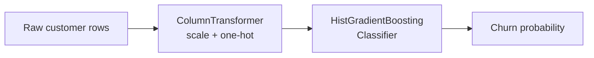

# Customer Churn Prediction (scikit-learn)

Binary classifier that predicts whether a telecom customer will churn, built as a clean scikit-learn `Pipeline`: preprocessing (`ColumnTransformer`) + `HistGradientBoostingClassifier`, evaluated with stratified train/test split and 5-fold cross-validation.

## Problem

Acquiring a new customer costs far more than keeping one. If you can flag at-risk customers early — short tenure, month-to-month contract, rising support calls — a retention team can act before they leave.

## Approach

1. **Data** (`src/data.py`): 5,000 customers, seeded synthetic telecom dataset (clearly labeled synthetic; reproducible via `SEED=42`). Features: tenure, monthly/total charges, contract type, internet service, payment method, support calls.
2. **Preprocessing**: `StandardScaler` on numerics, `OneHotEncoder` on categoricals — inside the pipeline so CV never leaks.
3. **Model**: `HistGradientBoostingClassifier`.
4. **Evaluation**: 80/20 stratified split + 5-fold CV (ROC-AUC).



## Results

Measured by running `python src/train.py`:

| Metric | Value |
|---|---|
| Rows | 5,000 (churn rate 29.0%) |
| CV ROC-AUC | 0.7451 ± 0.0246 |
| Test accuracy | 0.7500 |
| Test precision | 0.5926 |
| Test recall | 0.4414 |
| Test F1 | 0.5059 |
| Test ROC-AUC | 0.7683 |

Honest read: the model ranks customers well (ROC-AUC ~0.77) but recall on churners is the weak spot (0.44) — expected with a 29% positive class and no threshold tuning. Next step would be threshold tuning or class weighting for recall.

## Run it

```bash
pip install -r requirements.txt
cd src
python train.py     # trains + prints metrics
python predict.py   # churn probability for one sample customer
```

`predict.py` scores a high-risk profile (3 months tenure, month-to-month, fiber, 4 support calls) at **0.91** churn probability — the model behaves the way the business logic says it should.

## Tech Stack

Python, pandas, NumPy, scikit-learn.

## License

MIT
